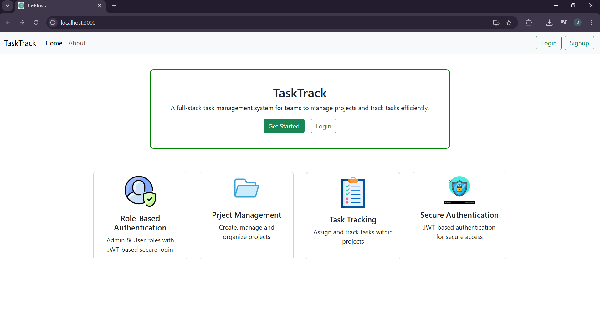
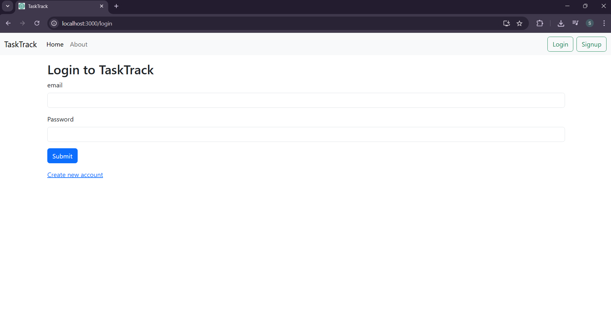
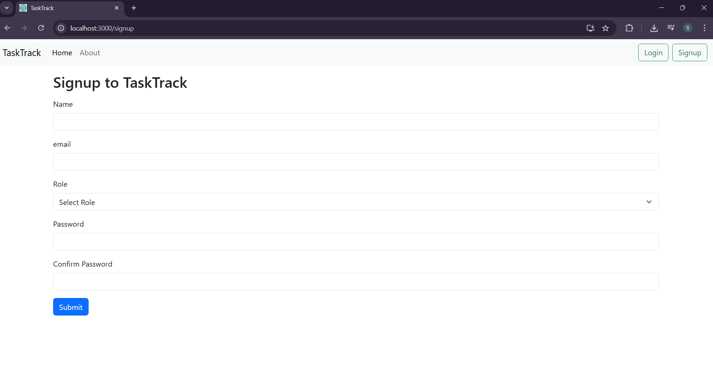
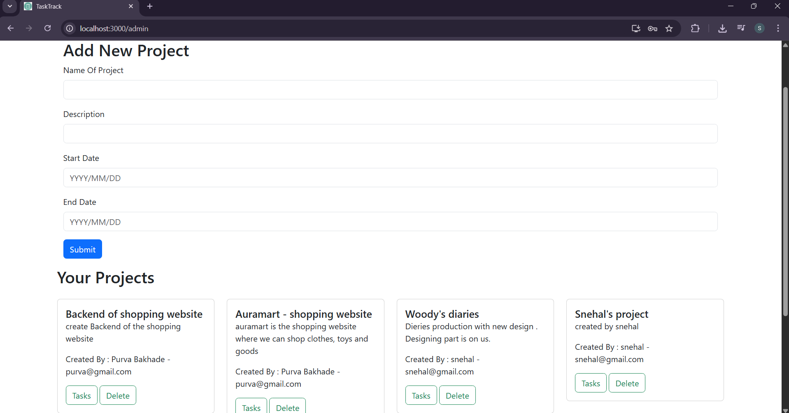
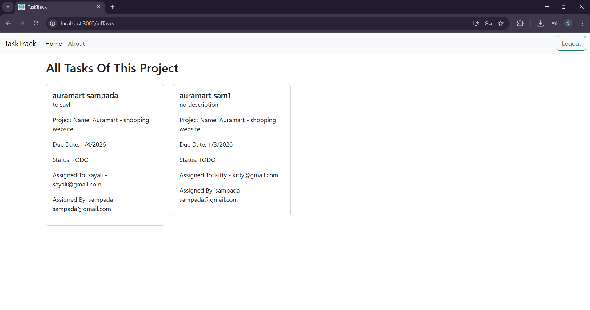
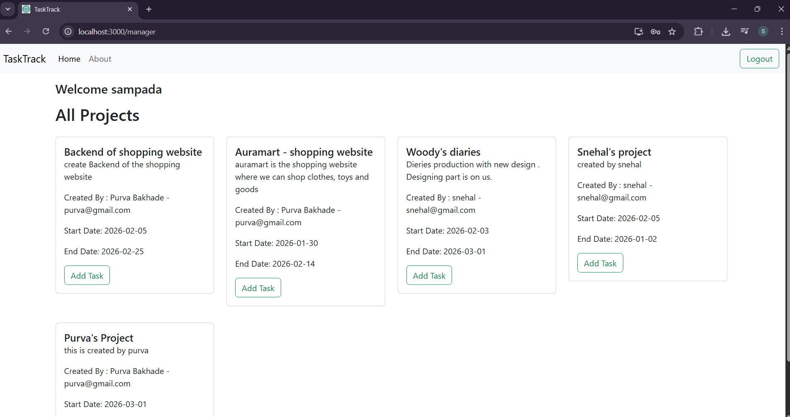
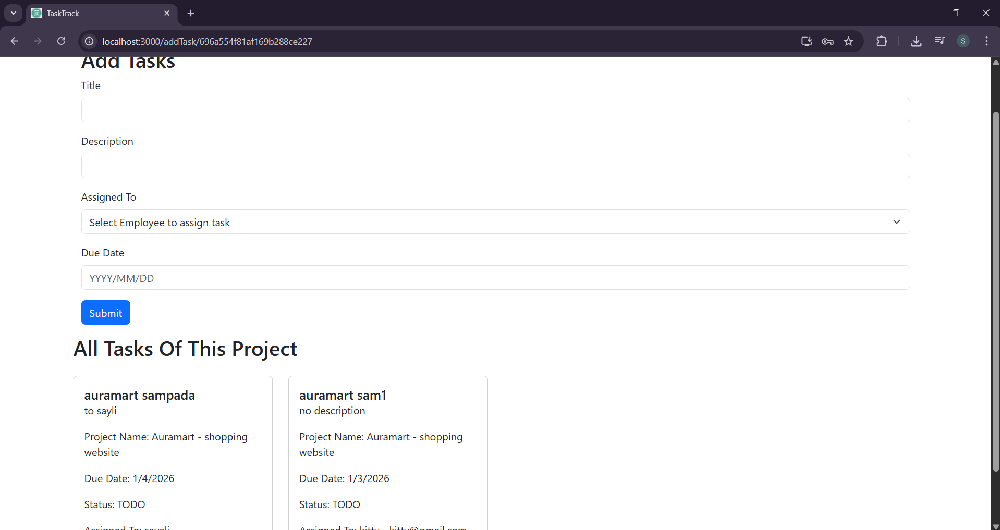
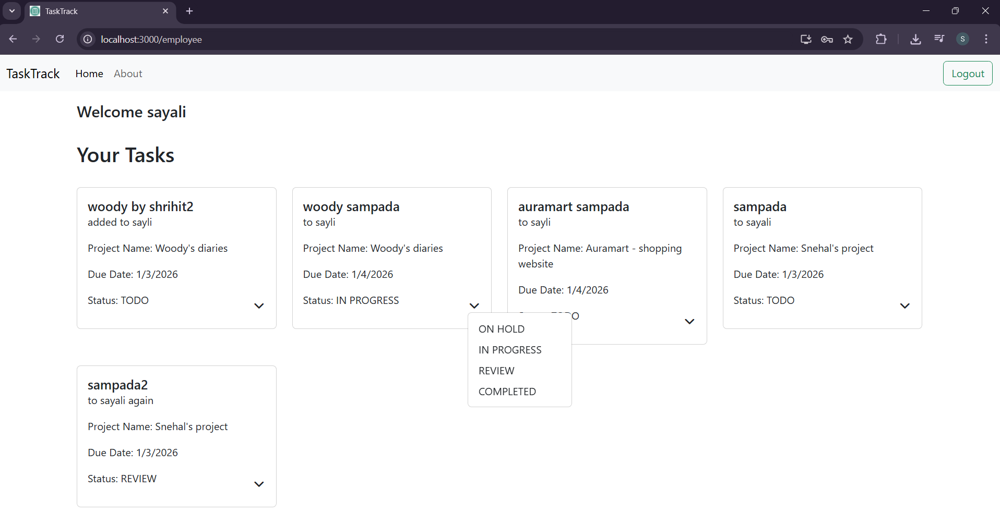

TaskTrack is a full-stack task and project management application built for role-based users (Admin, Manager, Employee). It allows admins to create projects, managers to assign tasks, and employees to track and update their task status — all in real-time using React, Node.js, Express, and MongoDB.

Features:
1. Role-Based Access Control
    -Admin: Add/Delete Projects, View All Projects, View All Tasks assigned to the Project by Manager.
    -Manager: Assign Tasks to Employees, View all Projects and Tasks.
    -Employee: View assigned Tasks, Update Task Status.
2. Authentication
    -Secure signup/login with JWT tokens
    -Password hashing using bcrypt
3. Project & Task Management 
    -Admin can create and delete projects
    -Manager can assign tasks to employees under projects
    -Employees can update task status (HOLD, IN-PROGRESS, RIVIEW, COMPLETED)
4. Dynamic Dashboard
    -Personalized welcome messages
    -Project/task lists update in real-time
5. Frontend
    -React.js with Context API for state management
    -Role-based routing
    -Responsive UI using Bootstrap
6. Backend
    -Node.js + Express.js
    -RESTful APIs
    -MongoDB database for persistent storage
    -Middleware for authentication and access control

Tech Stack:
Frontend - React.js, Context API, Bootstrap
Backend - Node.js, Express.js
Database - MongoDB, Mongoose
Authentication - JWT, bcrypt
API Testing - Thunderclient
Version Control - Git, GitHub

Role-Based Functionality:
Admin - Create/Delete Projects, View Projects, View Tasks assigned by   Managers
Manager - Assign Tasks, View Projects & Tasks
Employee - View Tasks assigned to them, Update task status

Setup Instructions:
Prerequisites
    Node.js(v16+ recommended)
    npm 
    MongoDB

Backend and Frontend 
    npm run both
    Backend server rns at: http://localhost:4000 and Frontend also starts because of the usage of concurrently.

API Endpoints Overview:
Auth:
1.  Method: POST
    Endpoint: /api/auth/signup
    Description: Create new user
    Access: Public
2.  Method: POST
    Endpoint: /api/auth/login
    Description: Login user
    Access: Public

Projects:
1.  Method: POST
    Endpoint: /api/user/addProject
    Description: Create Project
    Access: Admin only
2.  Method: DELETE
    Endpoint: /api/user/deleteProject/:id
    Description: Delete project
    Access: Admin only
3.  Method: GET
    Endpoint: /api/user/fetchAllProjects
    Description: Fetch all projects
    Access: Admin/Manager

Tasks:
1.  Method: POST
    Endpoint: /api/user/addTask
    Description: Add a task to project
    Access: Manager only
2.  Method: GET
    Endpoint: /api/user/fetchAllTaskOfProject/:id
    Description: Fetch all tasks of project
    Access: Admin/Manager
3.  Method: GET
    Endpoint: /api/user/fetchAllTaskOfEmployee/:id 
    Description: Fetch all tasks assigned
    Access: Employee
4.  Method: PUT
    Endpoint: /api/user/updateStatus/:id
    Description: Update task status
    Access: Employee

Users:
1.  Method: GET
    Endpoint: /api/user/fetchAllEmployees
    Description: Get all employees
    Access: All roles

Future Improvements:
    -Implement real-time updates using WebSockets
    -Add drag-and-drop functionality for tasks
    -Integrate email notifications for task assignments

Screenshots:
Home - Landing Page

Login page

Signup page

Admin - Home page

Admin - FetchAllTasks page

Manager - Home page

Manager - AddTask page

Employee - Home page
